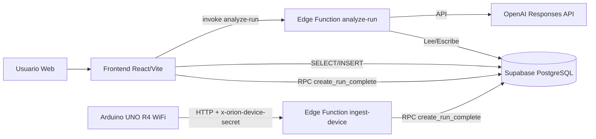

# Documentación del Proyecto — Orion Site

Estimados estudiantes,

Para el avance del proyecto que han venido desarrollando durante el último mes, deberán realizar la entrega de una versión estructurada y documentada de su sistema, utilizando buenas prácticas propias de la ingeniería de software.

La entrega debe realizarse mediante un repositorio en GitHub, el cual debe contener el proyecto completo, funcional y organizado.

---

## 1) Documento principal del proyecto

### Descripción general del sistema
**Orion Site** es una plataforma web orientada a la gestión y visualización de telemetría para un equipo STEM Racing. Incluye:
- Sitio público institucional del equipo.
- Módulo de laboratorio (acceso restringido) para captura y análisis de corridas.
- Herramientas públicas de cálculo (modo boceto/local actualmente).
- Integración con Supabase para persistencia de datos y funciones server-side.

### Objetivo del proyecto
- Centralizar datos de pruebas (tiempos, reacciones, sensores, métricas calculadas).
- Facilitar análisis técnico para mejorar rendimiento del vehículo.
- Proveer una interfaz clara para el equipo interno y una vista pública para difusión.

### Tecnologías utilizadas
**Frontend**
- React 19
- Vite 8
- React Router
- Recharts (gráficos)
- Framer Motion (animaciones)
- Three.js + @react-three/fiber + @react-three/drei (visualizaciones 3D)

**Backend / Datos**
- Supabase (PostgreSQL, Auth, Edge Functions)
- SQL (esquema normalizado, vistas, triggers y RPC)
- OpenAI (consumido desde Edge Function para análisis IA)

**Firmware (componente complementario)**
- Arduino UNO R4 WiFi para adquisición de telemetría.

### Instrucciones para ejecutar el sistema (resumen)
1. Instalar dependencias: `npm install`
2. Configurar `.env.local` con variables de Supabase
3. Ejecutar: `npm run dev`
4. Abrir: `http://localhost:5173`

(Ver sección 5 para pasos detallados.)

### Evidencia visual (capturas de pantalla)
> Guardar las imágenes en `docs/screenshots/` y actualizar rutas si cambian.

- Home / landing:
  - ``
- Sección de análisis de datos:
  - ``
- Laboratorio de datos (interno):
  - ``
- Herramientas públicas:
  - ``
- Semáforo de reacción:
  - ``

---

## 2) Arquitectura del sistema

### Tipo de arquitectura
Arquitectura **cliente-servidor** con frontend SPA en React y backend basado en servicios de Supabase. A nivel interno sigue separación por capas (presentación, servicios, persistencia).

### Componentes principales
- **Frontend (cliente):** rutas, vistas, formularios, gráficos y lógica de interacción.
- **Backend de datos (Supabase/PostgreSQL):** tablas normalizadas, vistas, RPC y políticas RLS.
- **Servicios server-side (Edge Functions):** ingesta segura de dispositivo y análisis IA.
- **Firmware Arduino:** emite mediciones para ser integradas al flujo de telemetría.

### Comunicación entre componentes
- Frontend ↔ Supabase RPC: `create_run_complete(payload)`
- Frontend ↔ Supabase tablas/vistas: `runs`, `sensor_measurements`, `calculated_metrics`, `v_run_dashboard`, etc.
- Frontend ↔ Edge Function: `analyze-run` (análisis IA)
- Dispositivo ↔ Edge Function: `ingest-device` con secreto en header

### Diagrama representativo (Mermaid)


---

## 3) Diseño de base de datos

### Tablas principales
1. `runs`
   - Contexto de corrida: aceite, modelo, peso, pista, observaciones, publicación.
2. `sensor_measurements`
   - Datos medidos: tiempos de reacción, sensores S1/S2, vueltas, payload de telemetría.
3. `calculated_metrics`
   - Métricas derivadas (velocidad, aceleración estimada, mejor tiempo, reacción promedio).
4. `ai_insights`
   - Salida de análisis IA: resumen, alertas, recomendaciones, paneles y confianza.
5. `calc_team_records`
   - Registros de herramientas públicas (equipo, categoría, tipo de cálculo, entradas/resultados).

### Relaciones entre tablas
- `runs (1) -> (1) sensor_measurements` por `run_id`.
- `runs (1) -> (1) calculated_metrics` por `run_id`.
- `runs (1) -> (N) ai_insights` por `run_id`.
- `auth.users (1) -> (N) calc_team_records` por `user_id`.

### Justificación básica del diseño
- Separación entre **datos crudos** (`sensor_measurements`) y **datos derivados** (`calculated_metrics`) para trazabilidad.
- `ai_insights` desacoplado para conservar historial de análisis.
- Uso de índices por fecha y claves de relación para consultas de dashboard.
- Uso de RLS en tablas sensibles para control de acceso por rol/usuario.

### Script / fragmentos de creación
- Esquema inicial: `database/schema.sql`
- Migración normalizada: `database/migrations/002_normalized_telemetry.sql`
- Herramientas públicas:
  - `supabase/migrations/20260417120000_calc_team_records.sql`
  - `supabase/migrations/20260417200000_calc_team_category.sql`

---

## 4) Documentación de servicios del sistema

### 4.1 Edge Function: `ingest-device`
- **Método HTTP:** `POST`
- **Ruta:** `/functions/v1/ingest-device`
- **Headers requeridos:**
  - `x-orion-device-secret: <DEVICE_INGEST_SECRET>`
  - `Content-Type: application/json`
- **Entrada (body):** payload plano compatible con `create_run_complete`.
- **Respuesta esperada (éxito):**
```json
{ "ok": true, "run_id": "<uuid>" }
```

### 4.2 Edge Function: `analyze-run`
- **Método HTTP:** `POST`
- **Ruta:** `/functions/v1/analyze-run`
- **Entrada (body):**
```json
{ "run_id": "<uuid>" }
```
- **Respuesta esperada (éxito):** JSON con análisis guardado en `ai_insights`.

### 4.3 RPC SQL: `create_run_complete`
- **Invocación:** `supabase.rpc("create_run_complete", { payload })`
- **Método conceptual:** `POST` (sobre endpoint RPC de Supabase)
- **Entrada:** `payload jsonb` con datos de corrida y sensores.
- **Salida:** UUID de la corrida creada.

### 4.4 Operaciones de datos (frontend)
- Inserción y consulta en `calc_team_records` (métricas públicas).
- Lectura de `v_run_dashboard` para vista consolidada.
- Actualización de `runs.is_published`.

---

## 5) Cómo ejecutar el sistema (detallado)

### Requisitos previos
- Node.js 18+ (recomendado 20+)
- npm 9+
- Cuenta/proyecto Supabase (si se usará persistencia real)

### Variables de entorno
Crear `/.env.local` con al menos:
```bash
VITE_SUPABASE_URL=https://<tu-proyecto>.supabase.co
VITE_SUPABASE_ANON_KEY=<tu-anon-key>
```

### Pasos para levantar el proyecto
1. Clonar repositorio.
2. Entrar al proyecto:
   - `cd orion-site`
3. Instalar dependencias:
   - `npm install`
4. Ejecutar en desarrollo:
   - `npm run dev`
5. Abrir navegador en:
   - `http://localhost:5173`

### Build de producción
- `npm run build`
- `npm run preview`

### Docker / entorno local
- **Estado actual:** el proyecto se ejecuta en entorno local Node/Vite.
- **Docker:** no implementado en esta versión.

---

## 6) Propuesta de mejoras futuras

### Funcionalidades pendientes
- Persistencia en backend para todas las herramientas públicas (actualmente algunas están en modo boceto/localStorage).
- Panel de administración para métricas de equipos externos.
- Historial comparativo por temporada/categoría.

### Posibles optimizaciones
- Code splitting adicional para reducir tamaño de bundles principales.
- Caché de consultas frecuentes de dashboard.
- Mejoras de accesibilidad (teclado, lector de pantalla, contrastes).

### Evolución del sistema
- Integración de autenticación por roles más granular.
- Exportación avanzada de reportes (CSV/JSON/PDF).
- Pipeline de análisis predictivo sobre datos históricos de corridas.

---

## Criterios de revisión (alineación con la consigna)
- El proyecto debe estar funcional al momento de la revisión.
- La documentación debe ser coherente con lo implementado.
- Se evalúa claridad, orden, comprensión técnica y calidad general.
- No basta con que “funcione”: se evidencia dominio del proceso de desarrollo.

---

## Checklist rápido antes de entregar
- [ ] Repositorio en GitHub actualizado
- [ ] Capturas reales agregadas en `docs/screenshots/`
- [ ] Variables de entorno documentadas (sin exponer secretos)
- [ ] Secciones de arquitectura y BD revisadas por el equipo
- [ ] Pruebas básicas de ejecución realizadas (`npm run dev`, `npm run build`)
